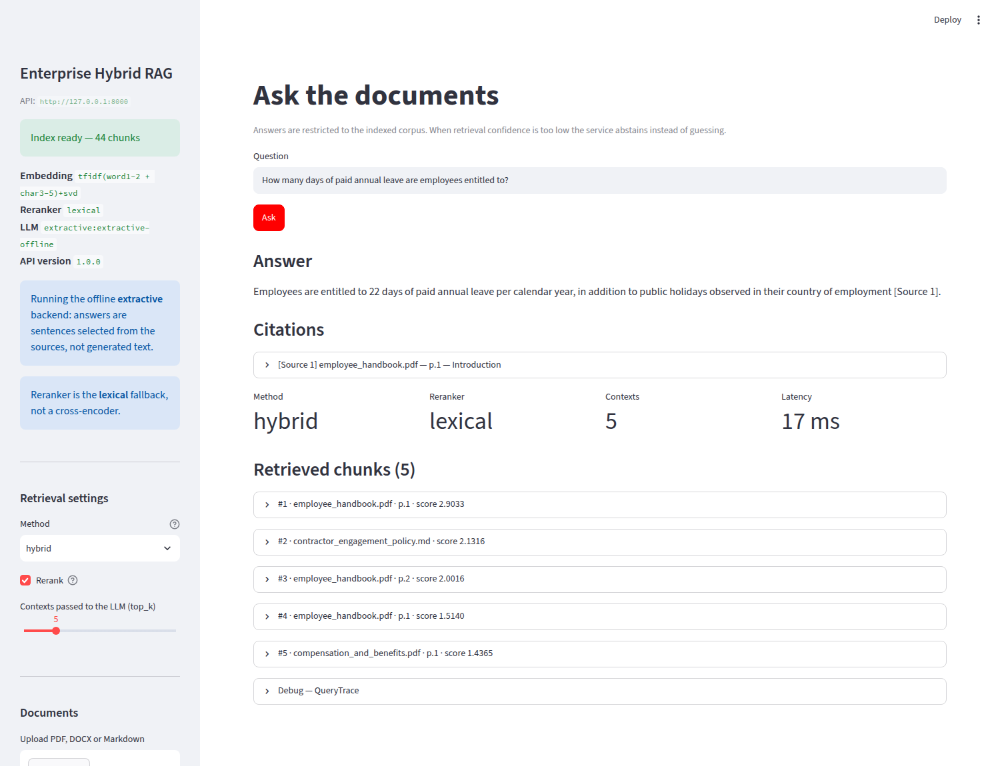
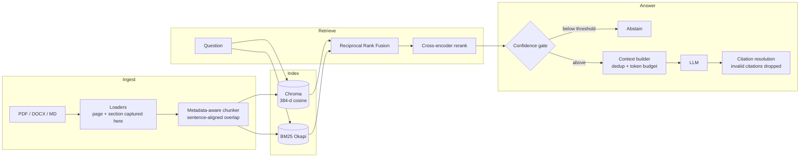
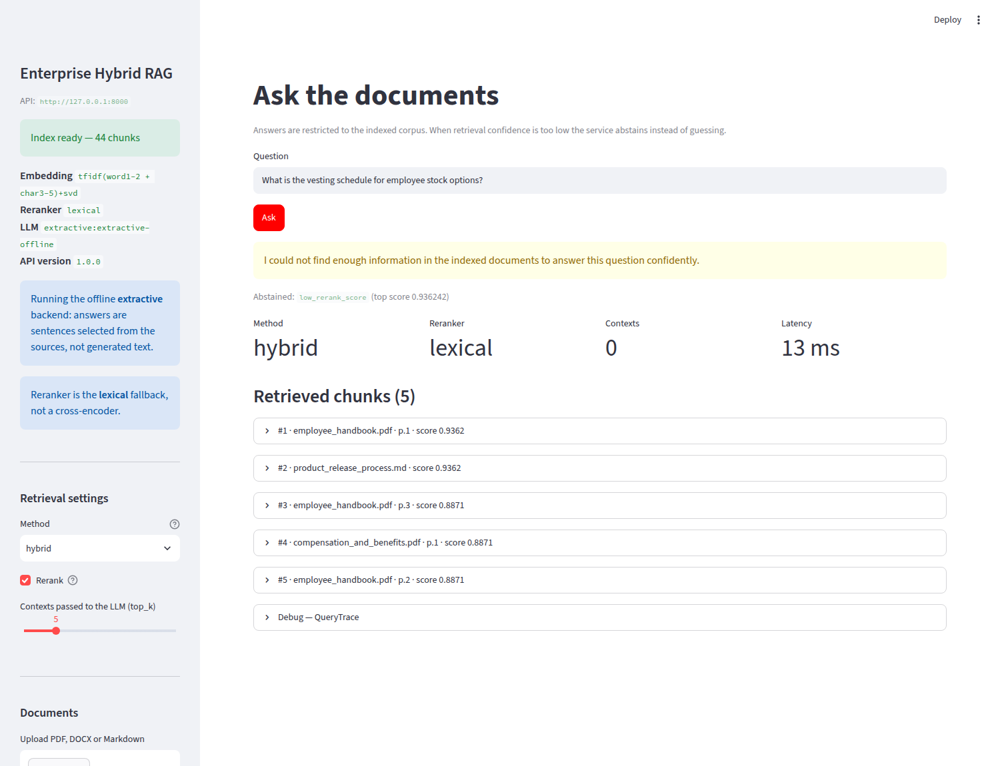

# Enterprise Hybrid RAG

**Document-grounded question answering over PDF, DOCX and Markdown — built without a RAG framework, so every ranking decision is inspectable and every number below comes from a run you can reproduce.**

[](https://github.com/tu-h-nguyn/Enterprise-Hybrid-RAG/actions/workflows/ci.yml)
[](https://github.com/tu-h-nguyn/Enterprise-Hybrid-RAG/actions/workflows/benchmark.yml)




---

## The finding

Swapping the offline fallback backends for real neural models (`all-MiniLM-L6-v2` + `ms-marco-MiniLM-L-6-v2`) made **no configuration better except the full one** — and made dense retrieval on its own measurably worse:

| Configuration | R@1 fallback | R@1 neural | Δ |
|---|---|---|---|
| Dense only | 0.6550 | 0.5853 | **−0.0697** |
| BM25 only | 0.6434 | 0.6434 | ±0.0000 |
| Hybrid (RRF) | 0.6550 | 0.6434 | −0.0116 |
| **Hybrid + Reranker** | 0.6434 | **0.7946** | **+0.1512** |

That looks wrong until you break it down by question type:

| Recall@1 | TF-IDF fallback | Dense (MiniLM) | BM25 | Hybrid + Reranker |
|---|---|---|---|---|
| **keyword** — `HB-7.2`, `FIN-TE-4`, `SEV1` | **1.0000** | 0.4286 | **1.0000** | **1.0000** |
| **paraphrased** — no shared vocabulary | 0.1111 | **0.4444** | 0.1111 | **0.4444** |
| **terminology** — a defined term, asked plainly | 0.8333 | 0.3333 | 0.8333 | **1.0000** |

The TF-IDF fallback scores a **perfect 1.0000** on keyword questions, because character n-grams match a reference code literally — and almost never handles paraphrase (**0.1111**). MiniLM is the mirror image: paraphrase **0.4444**, keyword **0.4286**. A sentence encoder compresses `FIN-TE-4` into a dense vector and loses it.

**Neither retriever is better. They fail in opposite directions.** Fused and reranked, the pipeline holds *both* ceilings at once — keyword 1.0000 and paraphrased 0.4444, each matching the best single retriever — and beats both of them on terminology, 1.0000 against 0.8333. That is the entire argument for hybrid retrieval, and it is only visible once real models are in place.

Fusion alone does not get there. Hybrid RRF without the reranker scores 0.5714 on keyword and 0.2222 on paraphrased — **worse than BM25 and worse than dense respectively**, on the categories each of them owns. The reranker is what turns a fused candidate list back into the best of both.

---

## Architecture



Both indexes are built from **the same chunk list in one pass** — if they drifted, fusion would silently combine two different documents.

---

## Measured results

`all-MiniLM-L6-v2` + `ms-marco-MiniLM-L-6-v2`, 22 documents / 77 chunks, 50 questions, regenerated by [the benchmark workflow](.github/workflows/benchmark.yml) on every pull request. Raw records: [`results.json`](enterprise-hybrid-rag/data/evaluation/results.json) · [`report.md`](enterprise-hybrid-rag/data/evaluation/report.md) · fallback run kept for comparison in [`results_fallback.json`](enterprise-hybrid-rag/data/evaluation/results_fallback.json).

| Configuration | R@1 | R@3 | R@5 | R@10 | MRR | nDCG@5 | mean ms |
|---|---|---|---|---|---|---|---|
| Dense only | 0.5853 | 0.8256 | 0.8953 | 0.9302 | 0.7740 | 0.7869 | 16.58 |
| BM25 only | 0.6434 | 0.8023 | 0.8023 | 0.8023 | 0.7597 | 0.7660 | **0.78** |
| Hybrid (RRF) | 0.6434 | 0.8023 | 0.8488 | **1.0000** | 0.7910 | 0.7862 | 17.04 |
| **Hybrid + Reranker** | **0.7946** | **0.8953** | 0.9070 | **1.0000** | **0.9085** | **0.8937** | 699.95 |

Hybrid + Reranker leads every quality column except Recall@5, and costs **nearly three orders of magnitude more per query than BM25** (699.95 ms against 0.78 ms). Reranking, not retrieval, is the request.

Two columns are worth stopping on. **BM25 recall does not move past rank 3** — 0.8023 at R@3, R@5 and R@10 alike: it finds the chunk in the first three or it never finds it, which is what a lexical matcher does when the words are not there. And **both fused configurations reach 1.0000 at R@10**, so everything the corpus can answer is inside ten candidates; from there the job is entirely ranking, which is exactly the job the reranker does.

Treat the timings as an order of magnitude, not a figure: the same pipeline over the same 77 chunks measured 685.39 ms in the corpus-scale run, on a different runner and through the exhaustive vector store. The quality columns, by contrast, reproduce exactly.

### Recall@1 by question type

| Configuration | factual | keyword | multi_step | paraphrased | terminology |
|---|---|---|---|---|---|
| Dense only | 0.9286 | 0.4286 | **0.4524** | **0.4444** | 0.3333 |
| BM25 only | 0.8571 | **1.0000** | 0.3810 | 0.1111 | 0.8333 |
| Hybrid (RRF) | **1.0000** | 0.5714 | 0.3810 | 0.2222 | 0.8333 |
| **Hybrid + Reranker** | **1.0000** | **1.0000** | **0.4524** | **0.4444** | **1.0000** |

The bottom row is not the maximum of the rows above it by accident, but it is close to it everywhere: the reranked pipeline matches the best single retriever on keyword, paraphrased and multi_step, and beats every one of them on factual and terminology.

`multi_step` is the weakest answerable category (0.4524) — questions needing evidence from two or more documents, where no reordering of a single-chunk ranking can help. That is the honest next problem, not a rounding error.

### The chunk size was chosen by measurement, and then changed

Re-ingested and re-indexed at each size, with ground truth re-resolved against the new chunks:

| Chunk size | Chunks | Hybrid + Reranker R@1 | R@5 | MRR |
|---|---|---|---|---|
| **256** *(default)* | 77 | **0.7946** | 0.9070 | **0.9085** |
| 500 | 44 | 0.7016 | 0.9186 | 0.8568 |
| 800 | 25 | 0.7481 | **0.9535** | 0.8747 |

The default used to be 500, and this table used to end with a shrug: 256 looked
9.3 points better at R@1, but one 50-question corpus of 44 chunks is thin
evidence, and a chunk size that wins on a corpus that small might be a fact
about the corpus rather than about chunking.

So it was measured properly. The [corpus-scale sweep](#it-still-works-when-the-corpus-gets-much-bigger)
below runs both sizes over corpora from 44 up to roughly 8500 chunks: **256 wins
Recall@1 at every size, by 0.0930 at the largest, and the gap does not shrink as
the corpus grows.** It also halves reranking latency, because the cross-encoder
scores passages half as long. The default moved to 256 on that evidence, and the
benchmark workflow now measures 500 against it so the decision stays checkable.

The cost is in the table above and is not hidden: 500 and 800 both beat 256 at
Recall@5. That comparison is not like-for-like across chunk sizes, though — five
chunks of 500 tokens hand the generator twice the text that five chunks of 256
do. The metrics where a longer chunk is structurally advantaged are R@1 and MRR,
because a bigger chunk is a bigger target to hit, and 256 wins those anyway.

### It still works when the corpus gets much bigger

77 chunks is a haybale, not a haystack: 40 of them are the answer to something, so
top-5 covers 6.5% of everything there is. So the questions, their answer spans and
every retrieval setting were held fixed while the corpus grew with **in-domain
distractor documents** — same topics, same register, same policy vocabulary, other
fictional companies ([`scripts/make_distractor_corpus.py`](enterprise-hybrid-rag/scripts/make_distractor_corpus.py)).
Recall@1, exhaustive search, neural backends, shipped chunk size:

| Chunks | Gold chunks are… | Dense | BM25 | Hybrid | **Hybrid + Reranker** |
|---:|---:|---:|---:|---:|---:|
| 77 | 51.95% of the corpus | 0.5853 | 0.6434 | 0.6434 | **0.7946** |
| 423 | 9.46% | 0.4690 | 0.6085 | 0.5853 | **0.7248** |
| 1704 | 2.35% | 0.4341 | 0.5969 | 0.5620 | **0.7248** |
| 8548 | **0.47%** | 0.3798 | 0.5969 | 0.4922 | **0.7248** |
| | **Δ over 111×** | **−0.2055** | −0.0465 | −0.1512 | **−0.0698** |

**Dense retrieval loses 35% of its Recall@1. The reranked pipeline loses 9%, and
then stops losing: 0.7248 at 423 chunks, 0.7248 at 1704, 0.7248 at 8548** — flat
across a twentyfold growth in the haystack, while the gold chunk goes from one in
1.9 to one in 213. Recall@5 falls from 0.9070 to 0.8062.

At 77 chunks the reranker is worth +0.2093 R@1 over dense alone; at 8548 chunks it
is worth **+0.3450**. Its value does not merely survive scale, it *grows* with it.
That is the argument for paying its latency, and it is invisible at the size the
rest of the evaluation runs at.

The distractors are doing real work rather than padding: at 8548 chunks **41.9% of
questions have a distractor at rank 1** under dense retrieval, and distractors hold
**75.4%** of the top 5. The reranked pipeline pushes those to 16.3% and 58.1%.

Two things this also settled, both of which had been assumptions:

- **Reranking cost does not grow with the corpus.** It always rescores a fixed
  top-k, so the cross-encoder never sees the corpus: no trend at all across the
  four sizes, around 0.7 s per query throughout, while dense search stayed in the
  tens of milliseconds and grew by about half for 111× the documents. Index build
  time is where the corpus is actually paid for — 8.87 s to 224.18 s.
- **Approximate search is free here — with real embeddings.** Every size was run
  against both Chroma's HNSW index and exhaustive cosine. With MiniLM,
  **Recall@1 was identical for every configuration at every size**, and the only
  difference anywhere was 0.0023 of dense MRR at the largest corpus. Under the
  offline TF-IDF fallback the same comparison loses 0.0233 R@1 to HNSW and is not
  even reproducible run to run — so "HNSW is fine" is a fact about these
  embeddings, not about HNSW.

Three guards make the numbers mean something, and each aborts the run rather than
reporting: a distractor containing a labelled answer span (a correct hit scored as
a miss), gold chunks that move as the corpus grows (a labelling artefact read as a
scale effect), and an embedder whose width changes with the corpus. Full table:
[`data/evaluation/scale_report.md`](enterprise-hybrid-rag/data/evaluation/scale_report.md).

> With 43 scored questions one question is 0.0233, which is why BM25 reads
> *higher* at 8548 chunks than at 1704. Read the trends, not the third decimal.

### Generation

Still the **extractive** backend — sentence selection, not a generative model, because CI has no API key. These describe that behaviour.

| Metric | Value |
|---|---|
| groundedness | 0.6434 |
| citation precision | 0.6512 |
| span coverage | 0.5078 |
| **correct refusal** (unanswerable) | **0.8571** |
| **over-refusal** (answerable) | **0.3488** |

The abstention gate correctly refuses 6 of 7 unanswerable questions, but also refuses 15 of 43 answerable ones. Run it against a local LLM to measure this properly — see [configuration](#configuration).

---

## Design decisions worth reading the code for

**Reciprocal Rank Fusion, not score averaging.** Cosine lives in `[-1, 1]`; BM25 is unbounded and corpus-dependent. Averaging them makes the blend depend on one query's score distribution, so a single outlier BM25 hit dominates. RRF discards magnitudes and uses ranks only: `RRF(d) = Σ wᵢ / (k + rankᵢ(d))`. With `k = 60`, a document ranked #1 by one retriever cannot beat a document ranked #2–#3 by both — the agreement signal is the point. [`app/retrieval/hybrid.py`](enterprise-hybrid-rag/app/retrieval/hybrid.py), ~15 lines, unit-tested against a hand-computed example.

**Ground truth is answer spans, not chunk IDs.** Chunk IDs change with chunk size, so pinned IDs would invalidate every label during the ablation above and read as a retrieval collapse. Labels are "document + verbatim span", resolved to chunks at evaluation time. Verified to resolve at all three chunk sizes. [`app/evaluation/dataset.py`](enterprise-hybrid-rag/app/evaluation/dataset.py)

**Unresolvable citations are deleted, not displayed.** The model writes `[Source 3]`; the answer layer resolves 3 back to the chunk that actually occupied slot 3. Numbers that do not resolve are stripped and counted — an unresolvable citation is a fabricated provenance claim. [`app/generation/answer.py`](enterprise-hybrid-rag/app/generation/answer.py)

**The abstention gate runs before generation.** Retrieval always returns a nearest neighbour, even when nothing relevant exists. Thresholds are **per stage**, because cosine, RRF mass and cross-encoder logits are not comparable quantities. [`app/services/confidence.py`](enterprise-hybrid-rag/app/services/confidence.py)



**Degrading is allowed; degrading silently is not.** Where the model hub is unreachable the system falls back to offline backends — and records which ones in `/health`, in every evaluation artefact, and in a warning printed by the benchmark. The benchmark workflow **pins** the neural backends rather than using `auto`, and asserts a 384-dimension embedder before measuring, so a blocked network fails the job instead of quietly publishing fallback numbers under a neural label.

---

## Quick start

```bash
cd enterprise-hybrid-rag
python -m venv .venv && source .venv/bin/activate
pip install -r requirements.txt

python scripts/ingest.py          # 22 documents -> 77 chunks, both indexes
uvicorn app.main:app --reload     # API on :8000, docs at /docs
```

```bash
API_URL=http://localhost:8000 streamlit run frontend/streamlit_app.py
```

```bash
docker compose up --build         # api :8000, ui :8501
```

### Or with nothing running at all

```bash
streamlit run frontend/streamlit_app.py     # no API_URL
```

With `API_URL` unset there is no API to talk to, so the UI starts the real
FastAPI app on a loopback socket **inside its own process** and builds the index
from `data/raw` on the first visit. It is still HTTP, to the same endpoints:
the transport changes, the contract does not. The UI never grows a second path
into retrieval, so what a visitor sees is what the API serves.

That is what makes a single-process host work with no configuration. To put this
at a URL: point [Streamlit Community Cloud](https://share.streamlit.io) at this
repository with **main file path** `enterprise-hybrid-rag/frontend/streamlit_app.py`.
The root `requirements.txt` exists for that platform — it selects the CPU build
of torch, because the PyPI wheel is the CUDA one and a free tier has nowhere to
put 3 GB of it.

Uploading is off by default in that mode: a hosted demo is one shared container,
so a document one visitor adds would change what the next visitor sees. Set
`UI_ALLOW_UPLOAD=1` to turn it back on.

### Ask it something

```bash
curl -X POST http://localhost:8000/query -H 'Content-Type: application/json' \
  -d '{"question":"How many days of paid annual leave are employees entitled to?"}'
```

```json
{
  "answer": "Employees are entitled to 22 days of paid annual leave per calendar year, in addition to public holidays observed in their country of employment [Source 1].",
  "citations": [{"source": "employee_handbook.pdf", "page": 1, "section": "Introduction"}]
}
```

---

## Configuration

Everything is one Pydantic `Settings` object; nothing else reads `os.environ`. Copy [`.env.example`](enterprise-hybrid-rag/.env.example) to `.env` — **it needs nothing to run**.

**No Hugging Face token is required.** Both models are public. Only the generation layer needs credentials, and even that is optional:

| | Key | Data leaves machine |
|---|---|---|
| OpenAI-compatible (also vLLM, Groq, Together) | ✅ | ✅ |
| Anthropic | ✅ | ✅ |
| **Ollama / any local server** | ❌ | ❌ |
| Extractive fallback | ❌ | ❌ |

```bash
LLM_PROVIDER=openai_compatible
LLM_BASE_URL=http://localhost:11434/v1
LLM_MODEL=llama3.1
LLM_API_KEY=ollama    # required non-empty; Ollama ignores the value
```

---

## Testing and CI

```bash
pip install -r requirements-dev.txt

ruff check .    # lint and import order
mypy            # 70 source files, clean
pytest          # 151 tests, no network and no API key
```

`mypy` runs over `app/`, `scripts/` and `frontend/` and reports no issues, which is what
makes "type hints everywhere" a checkable claim rather than a README assertion.
Line coverage is **79%**, and CI fails below 73% so it cannot quietly rot. The
uncovered remainder is mostly the Chroma backend (tests use the in-memory store
by design) and the DOCX loader.

The two network-backed LLM providers are covered without a network or a key, by
standing up a local HTTP server that speaks the same protocol. That is what
turns *"works with OpenAI, Anthropic or a local Ollama server"* from a claim in
a docstring into something the suite demonstrates — including that Anthropic's
different endpoint, headers and body shape genuinely work, which is the only
reason a second provider is worth carrying.

Unit tests cover the PDF loader against a PDF generated inside the test, chunker page/section provenance, RRF against a hand-computed example, BM25 and dense retrieval (the latter with a stub embedder and hand-placed vectors), reranker ordering, context budget and dedup, citation parsing, the gate per score scale, and the metric arithmetic. Integration tests cover ingest → index → query and the API via `TestClient`.

Two workflows run per pull request:

- **CI** — `ruff`, `mypy`, tests with a 73% coverage floor, ingest, a **blocking evaluation-label audit**, and an API smoke test, on pinned offline backends so the job is deterministic. The audit is a real gate: it was verified by deliberately corrupting an answer span and confirming a non-zero exit.
- **Docker** — builds both image targets with the Actions layer cache, ingests inside the container, then starts it and queries the live API. Without the cache this job re-downloaded ~3 GB of wheels every run and took anywhere from 2 to 37 minutes.
- **Benchmark** — the full suite on the neural backends. It compares what it just measured against the committed numbers on **quality metrics only**, since latency is wall-clock and moves every run. Identical output means the benchmark reproduced; it commits regenerated results only when a quality metric actually changed. Three independent runs on different runners agreed on all **698** compared values. The corpus-scale experiment runs as a second job in the same workflow and is held to the same standard, including an assertion that the embedder held at 384 dimensions at every corpus size before it is allowed to publish anything.

---

## Limitations

1. **The corpus is synthetic**, and the labelled part of it is small — 22 documents, 77 chunks, 43 scored questions, where one question is 0.0233. The scale experiment above grows it to 8548 chunks, but the added documents are generated from templates: they are hard negatives by construction, and a real corpus that size would hold both easier negatives and harder ones (near-duplicate revisions of the same policy). Treat every comparison as directional.
2. **Generation is not measured with a real LLM.** CI has no key, so those metrics describe sentence selection.
3. **The abstention threshold is tuned on one corpus** and over-refuses 34.9% of answerable questions.
4. **Token counts are a `chars/4` heuristic**, not a real tokenizer, so chunk sizes and context budgets are approximate.
5. **Reranking dominates latency** — 699.95 ms per query against BM25's 0.78 ms, and CI-runner timings vary about twofold run to run, so only the order of magnitude is meaningful.
6. **The image is large** — torch dominates it. It was 7.29 GB, because torch arrives as a dependency of sentence-transformers and the Linux wheel on PyPI is the CUDA build, for a container with no GPU. The Dockerfile now takes the `+cpu` build from PyTorch's own index, and CI asserts both halves of that: the installed torch must be a `+cpu` version, and the API image must stay under a 4 GiB ceiling. The exact size is printed by every Docker job.
7. **Indexing is a full rebuild**, not an incremental upsert — correct at this size, wrong at scale.

---

## Repository map

| Path | |
|---|---|
| [`app/ingestion/`](enterprise-hybrid-rag/app/ingestion) | Loaders, cleaner, metadata-aware chunker |
| [`app/indexing/`](enterprise-hybrid-rag/app/indexing) | Embedders, Chroma / NumPy vector stores, BM25 |
| [`app/retrieval/`](enterprise-hybrid-rag/app/retrieval) | Dense, sparse, RRF fusion, rerankers, context builder |
| [`app/generation/`](enterprise-hybrid-rag/app/generation) | Providers, prompts, citation resolution |
| [`app/evaluation/`](enterprise-hybrid-rag/app/evaluation) | Dataset schema, resolver, metrics, experiment runner |
| [`app/services/`](enterprise-hybrid-rag/app/services) | RAG pipeline, abstention gate, document lifecycle |
| [`scripts/`](enterprise-hybrid-rag/scripts) | Ingest, evaluate, benchmark, corpus-scale experiment |
| [`tests/`](enterprise-hybrid-rag/tests) | 151 unit and integration tests |
| [`HANDOFF.md`](enterprise-hybrid-rag/HANDOFF.md) | The engineering spec: interface contracts, status by phase, and what is still open |

**[Full technical write-up →](enterprise-hybrid-rag/README.md)** — evaluation methodology, why each decision was made, and the complete results.

**[Engineering spec →](enterprise-hybrid-rag/HANDOFF.md)** — the interface contracts the code is not allowed to break, and an honest list of what is still open.

---

MIT licensed — see [LICENSE](LICENSE).
