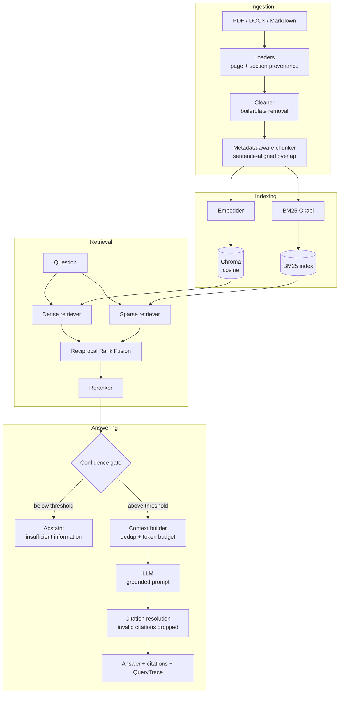

# Enterprise Hybrid RAG

Document-grounded question answering over PDF, DOCX and Markdown, built without
a RAG framework: the retrieval core is plain Python, so every ranking decision
is inspectable and every number below is reproducible from this repository.

```
ingest → chunk → dense + BM25 index → RRF hybrid → rerank → context → grounded answer with citations
```

---

## The problem

An organisation's answers live in policy PDFs, contracts and runbooks. Two
naive approaches both fail:

* **Keyword search** returns documents, not answers, and misses anything phrased
  differently from the query.
* **An LLM alone** answers fluently and sometimes falsely, with no provenance and
  no way to tell the two apart.

What is needed is an answer *restricted to the corpus*, *carrying citations back
to a page*, and *willing to say it does not know*. That third property is the
one most systems skip, and it is the one this project treats as a first-class
feature: retrieval always returns a nearest neighbour, even when the corpus
contains nothing relevant.

## Architecture



## Pipeline

| Stage | What it does | Why it is built this way |
|---|---|---|
| **Loaders** | PDF via PyMuPDF, DOCX via python-docx, Markdown natively | Page numbers and section headings are captured **at load time** and never re-derived, which is what makes a citation point at a place rather than a file |
| **Cleaner** | Strips running headers/footers repeated across pages | Boilerplate otherwise dominates BM25 term statistics |
| **Chunker** | Groups blocks into sections, packs sentences to a token budget, carries a sentence-aligned overlap | A chunk never starts mid-sentence and never merges two sections — sections are the strongest free semantic boundary |
| **Indexing** | Dense and sparse indexes built together from one chunk list | Both must address the same `chunk_id` or fusion silently combines different documents |
| **Retrieval** | Dense, BM25, or both fused with RRF | See below |
| **Reranking** | Cross-encoder over ~20 candidates | Retrieval optimises recall over a large pool; reranking optimises precision over a small one |
| **Confidence gate** | Per-stage score threshold before generation | Prevents paying for an LLM call when nothing relevant was retrieved |
| **Context builder** | Near-duplicate removal, token budget, numbered `[Source N]` blocks | Chunk overlap means the top-5 often repeats a sentence, which wastes budget and biases the model |
| **Answer layer** | Resolves `[Source N]` back to chunks; drops unresolvable numbers | An unresolvable citation is a hallucinated provenance claim and must never render as real |

### Why hybrid, and why RRF specifically

Dense and sparse retrieval fail in *different* directions:

* **Dense** generalises across vocabulary — "time off" finds "annual leave" — but
  is weak on rare exact tokens such as `HB-7.2` or `SEV1`, because those get
  averaged away in a fixed-width vector.
* **BM25** is unbeatable on identifiers, acronyms and quoted terminology, needs no
  training, but cannot match a paraphrase.

Combining them by **score** does not work: cosine similarity lives in `[-1, 1]`,
BM25 is unbounded and corpus-dependent. Averaging or min-max normalising makes
the blend depend on the score *distribution* of one particular query, so a
single outlier BM25 hit can dominate. Reciprocal Rank Fusion discards magnitudes
and uses only ranks:

```
RRF(d) = Σᵢ  wᵢ / (k + rankᵢ(d))
```

`k = 60` (Cormack et al. 2009) damps the very top ranks, so a document ranked #1
by one retriever cannot single-handedly beat a document ranked #2–#3 by *both*.
Documents found by both accumulate two terms and rise — that agreement signal is
the entire point. The implementation is ~15 lines in `app/retrieval/hybrid.py`
and is unit-tested against a hand-computed example.

### Why rerank

A bi-encoder must compress a chunk into a vector *before it has seen the query*.
A cross-encoder reads `(query, chunk)` jointly with full attention and can judge
whether the chunk actually answers the question. The cost is quadratic attention
per pair, which is why it only ever sees the ~20 fused candidates rather than
the whole corpus.

---

## Evaluation methodology

**Ground truth is answer spans plus source documents, not pinned chunk IDs.**
Chunk IDs change when `chunk_size_tokens` changes, so a dataset of pinned IDs
would silently invalidate every label during the chunk-size ablation and read as
a retrieval collapse. Instead a chunk counts as relevant when it comes from a
listed document *and* contains one of the answer spans, resolved at evaluation
time.

`RelevanceResolver.audit()` is run before any metric is reported, and both CLIs
**refuse to print numbers** if it returns anything — an unresolvable label drives
recall to zero and is indistinguishable from a retrieval failure.

The dataset is **50 questions over all 22 documents**, written by reading the
corpus:

| Type | Count | What it isolates |
|---|---|---|
| `factual` | 14 | Direct lookup |
| `paraphrased` | 9 | Deliberately shares no vocabulary with the source passage — only a semantic match can find these |
| `multi_step` | 7 | Requires evidence from two or more documents |
| `keyword` | 7 | Turns on a rare reference code (`HB-7.2`, `FIN-TE-4`, `ISP-2024-03`) — BM25 territory |
| `terminology` | 6 | Definition lookup |
| `unanswerable` | 7 | Plausible but absent from the corpus; the only correct behaviour is refusal |

Retrieval metrics exclude unanswerable questions (they have no relevant chunks);
those are scored separately by refusal behaviour.

### The backends that produced these numbers

Two configurations were benchmarked, and **both are kept in the repository** because the difference between them is the most interesting result here.

| Component | Neural run *(primary)* | Offline fallback run |
|---|---|---|
| Embedding | `all-MiniLM-L6-v2`, 384-d | `tfidf_svd` (word 1–2 + char 3–5 → SVD), 43-d |
| Reranker | `ms-marco-MiniLM-L-6-v2` cross-encoder | `lexical` feature scorer |
| LLM | `extractive` | `extractive` |
| Artefact | `results.json` | `results_fallback.json` |

The neural run is produced by `.github/workflows/benchmark.yml` on a GitHub runner, which can reach the model hub — the development sandbox could not, which is why the fallback run exists at all. **No Hugging Face token is involved**: both models are public.

The workflow **pins** the neural backends instead of using `auto`, and asserts a 384-dimension `sentence_transformers` embedder in the index manifest *before* measuring. Under `auto`, an unreachable hub would fall back silently and publish fallback numbers under a workflow named "neural" — precisely the failure this project is built to avoid.

The LLM stays `extractive` in both runs, because CI has no API key. **Generation metrics therefore describe sentence selection, not a generative model**, in both columns.

Measured on Python 3.11, Linux x86-64, 22 documents / 77 chunks at `chunk_size_tokens=256`, `rrf_k=60`, `dense_top_k = sparse_top_k = 20`.

---

## Results

Reproduce with `python scripts/benchmark.py`, or read `data/evaluation/report.md`.

### Retrieval comparison — neural backends

| Configuration | R@1 | R@3 | R@5 | R@10 | MRR | nDCG@5 | P@5 | mean ms | p95 ms |
|---|---|---|---|---|---|---|---|---|---|
| Dense only | 0.5853 | 0.8256 | 0.8953 | 0.9302 | 0.7740 | 0.7869 | 0.2186 | 16.58 | 21.26 |
| BM25 only | 0.6434 | 0.8023 | 0.8023 | 0.8023 | 0.7597 | 0.7660 | 0.2000 | **0.78** | **0.92** |
| Hybrid (RRF) | 0.6434 | 0.8023 | 0.8488 | **1.0000** | 0.7910 | 0.7862 | 0.2093 | 17.04 | 18.41 |
| **Hybrid + Reranker** | **0.7946** | **0.8953** | 0.9070 | **1.0000** | **0.9085** | **0.8937** | **0.2233** | 699.95 | 781.92 |

Hybrid + Reranker leads every quality column except Recall@5, and costs **nearly three orders of magnitude more per query than BM25** (699.95 ms against 0.78 ms). Reranking, not retrieval, is where the request time goes.

Two columns say more than the headline. **BM25 recall is identical at R@3, R@5 and R@10** (0.8023): it finds the chunk in the first three results or it never finds it, which is what a lexical matcher does when the query's words are not in the text. And **both fused configurations reach 1.0000 at R@10** — everything this corpus can answer is inside ten candidates, so from there the problem is entirely ranking, which is what the reranker is for. That is also why the reranker can reach 0.7946 at R@1 without a better retriever underneath it.

Those timings are an order of magnitude, not a figure. The same pipeline over the same 77 chunks measured 796.30 ms in the corpus-scale run — a different runner, and the exhaustive vector store rather than Chroma — whereas every quality column reproduces exactly.

Recall@5 is high everywhere because 5 of 77 chunks is 6.5% of the corpus, so **R@1 and MRR remain the discriminative metrics** and differences of a few points across 43 scored questions are within noise.

### What changed when real models replaced the fallbacks

| Configuration | R@1 fallback | R@1 neural | Δ | MRR fallback | MRR neural | Δ |
|---|---|---|---|---|---|---|
| Dense only | 0.6550 | 0.5853 | **−0.0697** | 0.7785 | 0.7740 | −0.0045 |
| BM25 only | 0.6434 | 0.6434 | ±0.0000 | 0.7597 | 0.7597 | ±0.0000 |
| Hybrid (RRF) | 0.6550 | 0.6434 | −0.0116 | 0.7784 | 0.7910 | +0.0126 |
| **Hybrid + Reranker** | 0.6434 | **0.7946** | **+0.1512** | 0.7541 | **0.9085** | **+0.1544** |

A better embedder made **dense retrieval on its own worse**, left BM25 exactly where it was, and moved plain fusion by less than a question. Only the full pipeline gained, and it gained a great deal: +0.1512 R@1 and +0.1544 MRR.

BM25 is unchanged, as it must be — it does not use the embedder — and the identical numbers are a useful sanity check that nothing else drifted between the two runs.

The explanation is entirely in the per-type breakdown below: the TF-IDF fallback's character n-grams matched reference codes **literally**, scoring a perfect 1.0000 on keyword questions with what the manifest calls a "dense" retriever. A sentence encoder compresses `HB-7.2` into a dense vector and loses it. What MiniLM buys instead is the only real paraphrase handling in the system — and it is the cross-encoder that turns that trade into a net gain rather than a wash.

### Recall@1 by question type — where the retrievers actually differ

| Configuration | factual | keyword | multi_step | paraphrased | terminology |
|---|---|---|---|---|---|
| Dense only | 0.9286 | 0.4286 | **0.4524** | **0.4444** | 0.3333 |
| BM25 only | 0.8571 | **1.0000** | 0.3810 | 0.1111 | 0.8333 |
| Hybrid (RRF) | **1.0000** | 0.5714 | 0.3810 | 0.2222 | 0.8333 |
| **Hybrid + Reranker** | **1.0000** | **1.0000** | **0.4524** | **0.4444** | **1.0000** |

### MRR by question type

| Configuration | factual | keyword | multi_step | paraphrased | terminology |
|---|---|---|---|---|---|
| Dense only | 0.9643 | 0.4762 | **1.0000** | **0.6056** | 0.6667 |
| BM25 only | 0.9167 | **1.0000** | 0.9286 | 0.1111 | 0.8889 |
| Hybrid (RRF) | **1.0000** | 0.6766 | 0.9286 | 0.3825 | 0.8889 |
| **Hybrid + Reranker** | **1.0000** | **1.0000** | **1.0000** | 0.5626 | **1.0000** |

Four findings, including the ones that are inconvenient:

1. **The two retrievers fail in opposite directions, and this is now measured rather than asserted.** Dense reaches 0.4444 on paraphrased questions where BM25 scores 0.1111; BM25 reaches a perfect 1.0000 on keyword questions where dense manages 0.4286. Neither is better. This is the whole premise of hybrid retrieval, and it only became visible with a real encoder — under the fallback, the "dense" arm was itself lexical and scored 1.0000 on keyword questions by accident.

2. **The reranker is what makes the combination pay, and fusion alone is not enough.** Plain RRF scores 0.5714 on keyword and 0.2222 on paraphrased — *worse than BM25 and worse than dense respectively*, on the categories each of them owns. Fusion averages two disagreeing rankings and lands between them. The cross-encoder, reading query and chunk jointly, restores keyword to 1.0000 and paraphrase to dense's own 0.4444, and reaches a perfect MRR on four of the five answerable categories.

3. **Paraphrase remains the weakest retrieval story.** The pipeline ties plain dense at 0.4444 R@1, but dense still has the better MRR (0.6056 against 0.5626): the cross-encoder is itself trained on lexical-ish relevance and sometimes demotes a semantically right chunk that shares no words with the query. Better than the fallback's 0.1111, and far from solved.

4. **`multi_step` is the weakest answerable category overall** (0.4524 R@1 — though a perfect 1.0000 MRR, because the *first* relevant chunk is always ranked first and what is missing is the second one). These need evidence from two or more documents, and nothing in this pipeline decomposes a question or retrieves iteratively. No amount of reranking fixes it. That is the honest next problem.

### Chunk-size ablation

The corpus is re-ingested and both indexes rebuilt at each size, with ground truth re-resolved against the new chunks. Overlap is held at 20% so the comparison isolates chunk size. With a fixed 384-dimension encoder this comparison is finally clean — in the fallback run the embedding dimension was capped by corpus size and confounded it.

| Chunk size | Chunks | Mean tokens | Configuration | R@1 | R@5 | MRR | nDCG@5 |
|---|---|---|---|---|---|---|---|
| **256** *(default)* | 77 | 192.6 | Dense only | 0.5853 | 0.8953 | 0.7740 | 0.7869 |
| | | | BM25 only | 0.6434 | 0.8023 | 0.7597 | 0.7660 |
| | | | Hybrid (RRF) | 0.6434 | 0.8488 | 0.7910 | 0.7862 |
| | | | **Hybrid + Reranker** | **0.7946** | 0.9070 | **0.9085** | **0.8937** |
| **500** | 44 | 337.4 | Dense only | 0.5155 | 0.8295 | 0.6906 | 0.7199 |
| | | | BM25 only | 0.5969 | 0.9070 | 0.7694 | 0.8001 |
| | | | Hybrid (RRF) | 0.5620 | 0.8372 | 0.7362 | 0.7513 |
| | | | **Hybrid + Reranker** | 0.7016 | 0.9186 | 0.8568 | 0.8610 |
| **800** | 25 | 594.2 | Dense only | 0.5775 | 0.7791 | 0.7225 | 0.7196 |
| | | | BM25 only | 0.6318 | 0.8837 | 0.7966 | 0.8090 |
| | | | Hybrid (RRF) | 0.6318 | 0.8527 | 0.7870 | 0.7850 |
| | | | **Hybrid + Reranker** | 0.7481 | **0.9535** | 0.8747 | 0.8857 |

**256 tokens beats 500 by 9.3 points of R@1 for the production configuration**, 0.7946 against 0.7016, and by 5.2 points of MRR. Smaller chunks give the cross-encoder a tighter passage to judge and dilute each chunk's content less. 800 wins R@5 (0.9535), but a longer chunk makes a "hit" cover more text, so that metric flatters larger sizes by construction.

This table used to end with a shrug. The default stayed at 500 on the grounds
that one 50-question corpus of 44 chunks is not enough evidence to re-tune a
default on — a chunk size that wins on a corpus that small might be a fact about
the corpus rather than about chunking.

That objection was answerable, so it was answered. The [corpus-scale
experiment](#corpus-scale-experiment) below runs both sizes over corpora from 44
up to roughly 8500 chunks, and 256 wins Recall@1 at every one of them, by 0.0930
at the largest, with the gap refusing to shrink as the corpus grows. It also
halves reranking latency, because the cross-encoder scores passages half as
long. **The default is now 256**, and the benchmark workflow runs 500 as the
alternative against it, so the decision stays checkable rather than becoming
folklore.

What that costs is the Recall@5 column above, and it is worth being precise
about why it is not decisive. Five chunks of 500 tokens hand the generator twice
the text that five chunks of 256 do, so the larger sizes enter that metric with
double the context budget. The metrics where a longer chunk is *structurally*
advantaged are R@1 and MRR — a bigger chunk is a bigger target to hit — and 256
wins those anyway. A like-for-like comparison at a fixed context budget,
`top_k=10` at 256 against `top_k=5` at 500, is the follow-up this does not
attempt.

### Corpus-scale experiment

Every table above is computed on 44 chunks, 30 of which are the answer to some
question. That is a haybale, not a haystack: top-5 covers more than a tenth of
the corpus, Recall@5 saturates, and none of it answers whether the ranking
survives a realistic index.

So the 50 questions, their answer spans, the chunking and every retrieval
setting were pinned, and only the corpus grew — with distractor documents on the
**same topics, in the same register, with the same policy vocabulary**, for other
fictional companies ([`scripts/make_distractor_corpus.py`](scripts/make_distractor_corpus.py),
deterministic in its seed, never committed). Padding with off-topic prose would
have proved nothing: a policy question never retrieves a novel, recall would
have stayed flat, and the result would have been a rigged win.

Sizes are nested prefixes of one distractor set, so each corpus strictly
contains the smaller one, and everything is built in a temporary directory so
the served index is untouched. Recall@1, exhaustive search:

| Chunks | Documents | Gold share | Dense | BM25 | Hybrid (RRF) | **Hybrid + Reranker** |
|---:|---:|---:|---:|---:|---:|---:|
| 44 | 22 | 68.18% | 0.5155 | 0.5969 | 0.5620 | **0.7016** |
| 235 | 162 | 12.77% | 0.4574 | 0.5504 | 0.5039 | **0.6550** |
| 936 | 677 | 3.21% | 0.4109 | 0.5504 | 0.4806 | **0.6318** |
| 4658 | 3422 | 0.64% | 0.3643 | 0.5736 | 0.4457 | **0.6318** |
| | | **change** | **−0.1512** | −0.0233 | −0.1163 | **−0.0698** |

Dense retrieval gives up 29% of its Recall@1 across the range. The reranked
pipeline gives up 10%, and its Recall@5 falls only from 0.9186 to 0.8566. The
reranker is worth +0.1861 R@1 over dense alone at 44 chunks and **+0.2675** at
4658: its value is not constant, it *grows* with the corpus. That is the
argument for paying its latency, and it is invisible at 44 chunks.

BM25 is nearly flat (−0.0233, which is one question), which is the expected
shape — exact lexical matching does not care how much other text exists, only
whether something else matches better.

#### Are the distractors actually hard?

Asserting it would be worthless, so every row measures it. `distr@1` is the share
of answerable questions whose top hit is a distractor; `distr%@5` is the mean
share of the top 5 they hold:

| Chunks | Dense distr@1 | Dense distr%@5 | Reranked distr@1 | Reranked distr%@5 |
|---:|---:|---:|---:|---:|
| 235 | 0.2326 | 0.5535 | 0.1163 | 0.4233 |
| 936 | 0.3488 | 0.6837 | 0.1860 | 0.5581 |
| 4658 | 0.4186 | 0.7814 | 0.1628 | 0.6093 |

At the largest size the distractors take rank 1 on 42% of questions under dense
retrieval and hold 78% of the top 5. They compete.

#### What approximate search costs

Each size was also run against both vector stores — Chroma's HNSW index and
exhaustive cosine — because the difference is normally assumed rather than
measured. With `all-MiniLM-L6-v2`, **Recall@1 is identical for every
configuration at every size**, and the reranked pipeline matches on every metric.
Dense-only and hybrid differ only from rank 3 down, by one or two questions
(0.02–0.05 on recall at depth). BM25 never touches the vector store and
reads identical everywhere, which is the control confirming nothing else
differed between the two runs.

Those few HNSW values are also the only ones in the experiment that do not
reproduce: two runs on different GitHub runners agreed on **689 of 696** quality
values, and all seven that moved were Chroma rows — not one of them Recall@1.
That is the finding rather than a defect, so CI encodes it:
`compare_results.py --allow-drift 'scale.chroma/'` holds exhaustive search to
bit equality and prints the approximate index's drift instead of quietly
committing it.

That result does not transfer. Under the offline `tfidf_svd` fallback the same
comparison loses 0.0233 **R@1** to HNSW at both 936 and 4658 chunks, and is not
reproducible at all: repeated runs of the same command returned dense R@1 of
0.3643, 0.3411, 0.3876 and 0.3876 — the last two with BLAS threading pinned to
one core, which ruled out float reduction order and pointed at the index itself.
Exhaustive search returned 0.4109 twice and matched on all 86 compared values. "HNSW is fine" is a statement about how well-separated
these embeddings are, not about HNSW.

#### What it costs to run

| | 44 chunks | 4658 chunks |
|---|---:|---:|
| Index build | ~8 s | ~2.5 min |
| Dense query (exhaustive) | ~12 ms | ~24 ms |
| BM25 query | under 1 ms | ~12 ms |
| Hybrid + rerank query | ~1.4 s | ~1.4 s |

Rounded on purpose: these are wall-clock on a GitHub runner, and the same job on
a different runner moves them by tens of percent. The shape is the claim; the
exact figures for the committed run are in
[`scale_report.md`](data/evaluation/scale_report.md).

Reranking is flat because it always rescores a fixed top-k: the cross-encoder
never sees the corpus. At 44 chunks it is 99% of query latency, and at 4658 it is
still over 96%. Nothing about growing the corpus changes the thing that dominates.

#### Guards

Three failures would have turned this into a lie, so each one aborts the run
rather than reporting a number:

* **A distractor restating a labelled answer.** Relevance resolves per source
  document, so a distractor can never be *labelled* relevant — but it would be a
  correct answer scored as a miss. The run refuses to start if any distractor
  chunk contains a labelled span.
* **Gold chunks moving.** If re-ingestion shifted the resolved gold set, a fall
  in Recall@1 would be a labelling artefact rather than a scale effect. The run
  asserts the set is identical at every size.
* **An embedder that changes with the corpus.** `tfidf_svd` derives its width
  from the corpus rank (43 → 234 → 384 dims here), which would vary the encoder
  along with the haystack. CI asserts the embedder held at 384 dimensions at
  every size before it will publish anything.

The distractors remain synthetic. They are hard negatives by construction, but a
real corpus this size would hold both easier negatives — off-topic material —
and harder ones, such as near-duplicate revisions of the same policy. Full
output: [`data/evaluation/scale_report.md`](data/evaluation/scale_report.md).

### Generation

Produced by the **extractive** backend — sentence selection, not generation. These numbers describe that behaviour and are not LLM quality figures.

| Metric | Value |
|---|---|
| groundedness (answer bigrams present in context) | 0.6437 |
| answer_f1 (SQuAD-style token F1) | 0.3138 |
| span_coverage (labelled span appears in the answer) | 0.5078 |
| citation_precision | 0.6512 |
| uncited_sentence_rate | 0.3488 |
| mean citations per answer | 0.8372 |
| **over_refusal_rate** (answerable questions refused) | **0.3488** |
| **correct_refusal_rate** (unanswerable questions refused) | **0.8571** |
| mean latency | 1408.75 ms |

The gate correctly refuses **6 of 7** unanswerable questions and also refuses **15 of 43** answerable ones. Both rates are unchanged from the fallback run, which is itself informative: the gate's behaviour here is dominated by the extractive backend's exact-token matching rather than by retrieval quality, so improving the encoder did not move it. Measuring this properly needs a real LLM — point `LLM_BASE_URL` at a local Ollama server and re-run `scripts/evaluate.py --generation --judge`.

## Example

```bash
curl -X POST http://localhost:8000/query \
  -H 'Content-Type: application/json' \
  -d '{"question":"How many days of paid annual leave are employees entitled to?","top_k":5}'
```

```json
{
  "answer": "Employees are entitled to 22 days of paid annual leave per calendar year, in addition to public holidays observed in their country of employment [Source 2].",
  "citations": [
    {
      "source_index": 2,
      "chunk_id": "employee_handbook_001_000",
      "source": "employee_handbook.pdf",
      "page": 1,
      "section": "Introduction",
      "score": 3.308535
    }
  ],
  "metadata": {
    "retrieval_method": "hybrid", "reranker": "cross_encoder", "reranked": true,
    "n_candidates": 30, "n_final_contexts": 5, "context_tokens": 2390,
    "no_answer": false, "latency_ms": 1689.21,
    "stage_latency_ms": {"retrieval": 20.37, "rerank": 1664.59, "context": 1.49, "generation": 2.47}
  }
}
```

Captured from the container in CI, where the hub is reachable and `auto` therefore selects the neural backends. Note `rerank` at 1664.59 ms of a 1689.21 ms request: the cross-encoder *is* the latency budget.

A question the corpus cannot answer is refused rather than guessed:

```json
{
  "answer": "I could not find enough information in the indexed documents to answer this question confidently.",
  "citations": [],
  "metadata": {"no_answer": true, "no_answer_reason": "low_rerank_score", "top_score": 0.936242}
}
```

## API

| Method | Path | Purpose |
|---|---|---|
| `GET` | `/health` | Liveness, index readiness, and **which backends were actually selected** |
| `POST` | `/query` | Ask a question; returns answer, citations, retrieved chunks and the trace |
| `POST` | `/documents/upload` | Upload a PDF, DOCX or Markdown file |
| `POST` | `/documents/index` | Rebuild both indexes |
| `GET` | `/documents` | List indexed documents and files awaiting indexing |
| `DELETE` | `/documents/{source}` | Remove a source file |

Interactive docs at `/docs`.

## Install and run

```bash
python -m venv .venv && source .venv/bin/activate
pip install -r requirements.txt

python scripts/ingest.py                    # 22 documents -> 77 chunks, both indexes
uvicorn app.main:app --reload               # API on :8000
API_URL=http://localhost:8000 streamlit run frontend/streamlit_app.py   # UI on :8501
```

Evaluation:

```bash
python scripts/evaluate.py --audit-only     # verify dataset labels resolve
python scripts/evaluate.py                  # four-configuration comparison
python scripts/benchmark.py                 # + chunk ablation -> results.json, report.md
```

`scripts/benchmark.py` builds the ablation indexes in a temporary directory, so
the index the API is serving is never replaced by an ablation build.

### A single process, for a hosted demo

```bash
streamlit run frontend/streamlit_app.py     # note: no API_URL
```

Streamlit Community Cloud and Hugging Face Spaces run one process, so there is
nowhere to put a separate `uvicorn` for the UI to call. With `API_URL` unset,
`frontend/embedded_api.py` starts the real ASGI app on an OS-assigned loopback
socket in a daemon thread and waits for `/health` before the UI renders; if the
host has no index — `data/processed` is not committed, only `data/raw` is — the
first visitor's page load builds one, and every visitor after that finds it
ready.

The alternative was to let the UI import `RagService` and call it directly. That
was rejected: the UI would then hold a second, parallel path into retrieval, and
what a visitor sees would no longer be what the API serves. The port is chosen
by binding `127.0.0.1:0` and handing the already-listening socket to uvicorn,
rather than picking a free port and hoping it is still free a moment later.

Uploading is disabled in this mode by default, because a hosted demo is one
shared container and one visitor's document would change what the next visitor
sees. `UI_ALLOW_UPLOAD=1` re-enables it.

Five integration tests cover this path, including a fresh deployment building
its own index and answering a question over the socket, and an assertion that
every endpoint the UI calls exists on the app that gets embedded — so the demo
cannot drift from the deployment the rest of this README describes.

### Docker

```bash
docker compose up --build                   # api on :8000, ui on :8501
docker compose run --rm api python scripts/ingest.py
```

One image, two targets, built in CI through Buildx with the Actions layer cache
— plain `docker build` re-downloaded roughly 3 GB of wheels on every run, which
made that job take between 2 and 37 minutes depending on the runner. The build
pre-caches the neural weights so the first query is not a download; where the build host cannot reach the Hugging Face hub
the build still succeeds and the runtime falls back, reporting it in `/health`.
Containers run as a non-root user. **No secret is ever baked into the image** —
keys come from the environment or a gitignored `.env`.

Both targets are built in CI, which then ingests inside the container and
queries the running API, so the image is verified rather than merely written.
Note that `data/` is a bind mount by design — the corpus is not baked in — and
the container runs as uid 10001, so the mounted directory has to be writable by
that uid.

## Configuration

Everything is one Pydantic `Settings` object (`app/config/settings.py`); nothing
else reads `os.environ`. Any field can be set by environment variable.

| Variable | Default | Notes |
|---|---|---|
| `EMBEDDING_BACKEND` | `auto` | `auto` \| `sentence_transformers` \| `tfidf_svd` |
| `RERANKER_BACKEND` | `auto` | `auto` \| `cross_encoder` \| `lexical` \| `none` |
| `LLM_PROVIDER` | `auto` | `auto` \| `openai_compatible` \| `anthropic` \| `extractive` |
| `LLM_API_KEY` / `ANTHROPIC_API_KEY` | — | Never hard-coded |
| `CHUNK_SIZE_TOKENS` / `CHUNK_OVERLAP_TOKENS` | `500` / `100` | |
| `RETRIEVAL_METHOD` | `hybrid` | `dense` \| `sparse` \| `hybrid` |
| `RRF_K` | `60` | Fusion damping constant |
| `RERANK_TOP_K` | `5` | Contexts passed to the LLM |
| `NO_ANSWER_ENABLED` | `true` | Abstention gate |
| `LOG_CHUNK_TEXT` | `false` | Chunk text is never logged unless explicitly enabled |

`auto` prefers the neural models and degrades loudly — the substitution appears
in the logs, in `/health`, and in every evaluation artefact.

## Testing

```bash
pip install -r requirements-dev.txt

ruff check .             # lint and import order, configured in pyproject.toml
mypy                     # app/ and scripts/, 66 files, clean
pytest --cov=app         # 115 tests, 74% line coverage
```

`mypy` is configured pragmatically rather than strictly: `check_untyped_defs`,
`no_implicit_optional` and `strict_equality` are on, third-party libraries that
ship no stubs are excused by name, and the pydantic plugin is enabled — without
it every `Field(...)` default reads as a required argument and constructing
`Settings()` reports eighteen phantom missing arguments.

Coverage is **74%**, with CI failing below 73%. The floor sits just under the
current figure so it catches a regression without becoming a number to game, and
is ratcheted when real coverage rises — the LLM provider tests moved it from 70
to 73.
What is uncovered is mostly deliberate: the Chroma vector store (tests use the
in-memory `NumpyVectorStore`, which is the point of having the abstraction) and
the DOCX loader.

Unit tests cover the PDF loader against a PDF generated in the test, chunker
page/section provenance, RRF against a hand-computed example, BM25 and dense
retrieval (the latter with a stub embedder and exact vectors), reranker
ordering, context budget and dedup, citation parsing and stripping, the
confidence gate per score scale, and the metric arithmetic. Integration tests
cover ingest → index → query end-to-end and the API via `TestClient`. Fixtures
build a hermetic index in `tmp_path`, so the suite needs no network, no API key
and no pre-existing index.

`tests/unit/test_llm_providers.py` covers the two network-backed providers by
standing up a real HTTP server on localhost rather than mocking the client, so
the assertions are about what actually goes over the wire: that OpenAI-shaped
requests reach `/chat/completions` with a bearer token and the system message
kept separate from the user turn, that Anthropic reaches `/messages` with
`x-api-key` and `system` at the top level, and that an HTTP error or a malformed
200 becomes an `LLMError` rather than an empty answer that would read downstream
as a model with nothing to say. Before these, `llm.py` sat at 56% and every
production provider path was untested.

A third workflow, `.github/workflows/benchmark.yml`, re-measures on the neural
backends and then runs `scripts/compare_results.py` against the committed
numbers. It compares **quality metrics only** — those are deterministic given
the same corpus, dataset and backends, while latency is wall-clock and moves
every run — so results are re-committed only when a quality metric actually
changed, rather than on every run because timings drifted. Two independent runs
on different runners agreed on all **698** compared values, which is the
strongest reproducibility claim in this repository.

CI (`.github/workflows/ci.yml`) runs two jobs on every pull request:

* **Tests and dataset audit** — `ruff`, `mypy`, the suite under a 73% coverage
  floor, then ingest, then a label audit, then an API smoke test. The audit is a blocking gate on purpose: a chunker or
  loader change can stop answer spans resolving, which would silently drive
  recall to zero and look exactly like a retrieval regression. This job pins the
  offline backends so it is deterministic — model output is not a stable thing
  to gate a merge on.
* **Docker image builds and serves** — builds both image targets, ingests inside
  the container, then starts it and queries the live API. Backends are left on
  `auto` here, so this is the one place the neural path is exercised; the
  selected backend is printed as evidence rather than asserted on, so a hub
  hiccup cannot turn the build red for the wrong reason.

## Limitations

The full list, including the interface contracts this code is not allowed to
break and the status of every phase, lives in [`HANDOFF.md`](HANDOFF.md) —
one copy, in this directory, because the paths in it are relative to here.

Stated plainly, because each one bounds how far the numbers above generalise.

1. **Retrieval is measured on real models; generation is not.** The tables above
   use `all-MiniLM-L6-v2` and the `ms-marco-MiniLM-L-6-v2` cross-encoder. The
   answer layer is still the extractive backend, because CI has no API key, so
   every generation metric describes sentence selection rather than a language
   model. Point `LLM_BASE_URL` at a local Ollama server to measure that half.
2. **Token counts are a `chars/4` heuristic, not a real tokenizer.** Every chunk
   size and context budget in this project is therefore approximate. A real
   tokenizer would shift chunk boundaries and change the ablation.
3. **The corpus is synthetic, and the labelled part of it is small** — 22
   documents, 77 chunks at the 256-token default. Recall@5 saturates, so R@1 and
   MRR are the only discriminative metrics, and differences of a few points
   across 43 scored questions are within noise: one question is 0.0233. The
   per-type rows rest on 6–14 questions each, which is few enough that a single
   question moves a row by 7–17 points. The corpus-scale experiment grows the
   index to 4658 chunks and shows the ranking holds, but it grows it with
   generated documents; the labelled questions are still 50, and no part of this
   has been validated against a real enterprise corpus.
4. **Reranking dominates latency** — 1416.77 ms per query against 0.72 ms for
   BM25 alone. Any deployment has to decide whether that precision is worth three
   orders of magnitude of latency, or whether to rerank only when the fusion
   margin is narrow. CI-runner timings vary about twofold between runs, so only
   the order of magnitude should be relied on.
5. **The no-answer threshold is tuned on one corpus** and is currently
   over-conservative: 34.9% of answerable questions are refused, including
   **every** paraphrased question. It has not been validated anywhere else and
   should be re-tuned per deployment — and re-tuned *after* the neural encoder
   is in place, since most of the over-refusal is a downstream symptom of
   lexical retrieval rather than a badly chosen constant.
6. **The LLM judge is approximate and is not ground truth.** It is
   non-deterministic, sensitive to the judge model, and biased toward the
   generator's style. It is reported in a separate block and never merged into
   the deterministic metrics. It did not run here — the extractive backend
   cannot judge, and refuses rather than emitting meaningless scores.
   The shipped `chunk_size_tokens=500` is also **not** the best value measured
   (256 beats it by 9.3 points of R@1); it is left as-is because one
   50-question corpus is thin evidence for re-tuning a default.
7. **Deterministic generation metrics measure lexical support, not truth.** A
   fully grounded answer can score below 1.0 simply by paraphrasing.
8. **Indexing is a full rebuild**, not an incremental upsert. Correct and fast at
   this size; wrong for a large corpus.
9. **The image is large, and torch is why.** It was 7.29 GB: `torch` arrives as
   a dependency of `sentence-transformers`, and on Linux the PyPI wheel is the
   CUDA build, in a container with no GPU. The Dockerfile now installs the
   `+cpu` build from PyTorch's own index — which needs no version pin, because
   `X.Y.Z+cpu` sorts above the plain `X.Y.Z` under PEP 440 — and the documented
   install is unchanged, since `requirements.txt` itself still names only
   `sentence-transformers`. The earlier worry that this trades one honest
   property for another is handled by asserting both halves in CI rather than
   trusting them: the installed torch must report a `+cpu` version, and the api
   image must stay under a 4 GiB ceiling. The ceiling is deliberately loose. It
   is a regression guard against the CUDA wheels quietly coming back, not a size
   budget; the exact size is printed by every Docker job.

## Future work

* Measure generation against a real LLM (a local Ollama server needs no key and
  keeps the corpus on the machine), and turn the LLM judge on.
* Re-tune the abstention threshold against the over-refusal rate rather than
  inheriting a hand-picked constant.
* Incremental indexing to replace the full rebuild.
* A real tokenizer to replace the `chars/4` estimate.
* Query rewriting and multi-hop retrieval for the `multi_step` questions, which
  are the weakest answerable category (R@1 0.38–0.45).
* A larger, non-synthetic corpus, with human relevance judgements rather than
  answer-span resolution.
