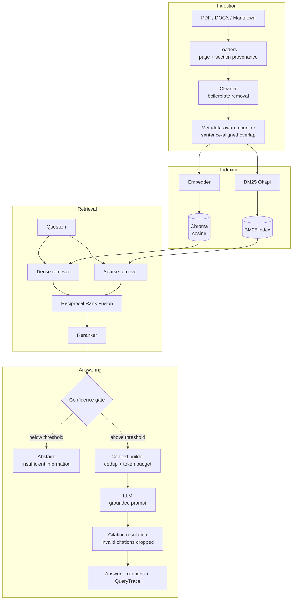

# Enterprise Hybrid RAG

Document-grounded question answering over PDF, DOCX and Markdown, built without
a RAG framework: the retrieval core is plain Python, so every ranking decision
is inspectable and every number below is reproducible from this repository.

```
ingest → chunk → dense + BM25 index → RRF hybrid → rerank → context → grounded answer with citations
```

---

## The problem

An organisation's answers live in policy PDFs, contracts and runbooks. Two
naive approaches both fail:

* **Keyword search** returns documents, not answers, and misses anything phrased
  differently from the query.
* **An LLM alone** answers fluently and sometimes falsely, with no provenance and
  no way to tell the two apart.

What is needed is an answer *restricted to the corpus*, *carrying citations back
to a page*, and *willing to say it does not know*. That third property is the
one most systems skip, and it is the one this project treats as a first-class
feature: retrieval always returns a nearest neighbour, even when the corpus
contains nothing relevant.

## Architecture



## Pipeline

| Stage | What it does | Why it is built this way |
|---|---|---|
| **Loaders** | PDF via PyMuPDF, DOCX via python-docx, Markdown natively | Page numbers and section headings are captured **at load time** and never re-derived, which is what makes a citation point at a place rather than a file |
| **Cleaner** | Strips running headers/footers repeated across pages | Boilerplate otherwise dominates BM25 term statistics |
| **Chunker** | Groups blocks into sections, packs sentences to a token budget, carries a sentence-aligned overlap | A chunk never starts mid-sentence and never merges two sections — sections are the strongest free semantic boundary |
| **Indexing** | Dense and sparse indexes built together from one chunk list | Both must address the same `chunk_id` or fusion silently combines different documents |
| **Retrieval** | Dense, BM25, or both fused with RRF | See below |
| **Reranking** | Cross-encoder over ~20 candidates | Retrieval optimises recall over a large pool; reranking optimises precision over a small one |
| **Confidence gate** | Per-stage score threshold before generation | Prevents paying for an LLM call when nothing relevant was retrieved |
| **Context builder** | Near-duplicate removal, token budget, numbered `[Source N]` blocks | Chunk overlap means the top-5 often repeats a sentence, which wastes budget and biases the model |
| **Answer layer** | Resolves `[Source N]` back to chunks; drops unresolvable numbers | An unresolvable citation is a hallucinated provenance claim and must never render as real |

### Why hybrid, and why RRF specifically

Dense and sparse retrieval fail in *different* directions:

* **Dense** generalises across vocabulary — "time off" finds "annual leave" — but
  is weak on rare exact tokens such as `HB-7.2` or `SEV1`, because those get
  averaged away in a fixed-width vector.
* **BM25** is unbeatable on identifiers, acronyms and quoted terminology, needs no
  training, but cannot match a paraphrase.

Combining them by **score** does not work: cosine similarity lives in `[-1, 1]`,
BM25 is unbounded and corpus-dependent. Averaging or min-max normalising makes
the blend depend on the score *distribution* of one particular query, so a
single outlier BM25 hit can dominate. Reciprocal Rank Fusion discards magnitudes
and uses only ranks:

```
RRF(d) = Σᵢ  wᵢ / (k + rankᵢ(d))
```

`k = 60` (Cormack et al. 2009) damps the very top ranks, so a document ranked #1
by one retriever cannot single-handedly beat a document ranked #2–#3 by *both*.
Documents found by both accumulate two terms and rise — that agreement signal is
the entire point. The implementation is ~15 lines in `app/retrieval/hybrid.py`
and is unit-tested against a hand-computed example.

### Why rerank

A bi-encoder must compress a chunk into a vector *before it has seen the query*.
A cross-encoder reads `(query, chunk)` jointly with full attention and can judge
whether the chunk actually answers the question. The cost is quadratic attention
per pair, which is why it only ever sees the ~20 fused candidates rather than
the whole corpus.

---

## Evaluation methodology

**Ground truth is answer spans plus source documents, not pinned chunk IDs.**
Chunk IDs change when `chunk_size_tokens` changes, so a dataset of pinned IDs
would silently invalidate every label during the chunk-size ablation and read as
a retrieval collapse. Instead a chunk counts as relevant when it comes from a
listed document *and* contains one of the answer spans, resolved at evaluation
time.

`RelevanceResolver.audit()` is run before any metric is reported, and both CLIs
**refuse to print numbers** if it returns anything — an unresolvable label drives
recall to zero and is indistinguishable from a retrieval failure.

The dataset is **50 questions over all 22 documents**, written by reading the
corpus:

| Type | Count | What it isolates |
|---|---|---|
| `factual` | 14 | Direct lookup |
| `paraphrased` | 9 | Deliberately shares no vocabulary with the source passage — only a semantic match can find these |
| `multi_step` | 7 | Requires evidence from two or more documents |
| `keyword` | 7 | Turns on a rare reference code (`HB-7.2`, `FIN-TE-4`, `ISP-2024-03`) — BM25 territory |
| `terminology` | 6 | Definition lookup |
| `unanswerable` | 7 | Plausible but absent from the corpus; the only correct behaviour is refusal |

Retrieval metrics exclude unanswerable questions (they have no relevant chunks);
those are scored separately by refusal behaviour.

### The backends that produced these numbers

**This run did not use neural models.** `huggingface.co` was unreachable from the
build environment and no LLM API key was present, so `auto` selection fell back:

| Component | Configured | **Actually used** |
|---|---|---|
| Embedding | `all-MiniLM-L6-v2` | **`tfidf_svd`** — TF-IDF (word 1–2 + char 3–5) → truncated SVD → L2-normalised, **dim 43** |
| Reranker | `ms-marco-MiniLM-L-6-v2` | **`lexical`** — a feature-based scorer, **not a cross-encoder** |
| LLM | OpenAI / Anthropic | **`extractive`** — selects supporting sentences from context, **not generative** |

The fallbacks are real, learned and deterministic — but the dense retriever here
is *lexical-semantic*, not neural. **Every number below is a floor, not a
measurement of MiniLM.** On a machine with network and a key, the same `auto`
settings pick the neural models with no code change, and the figure most likely
to move is the paraphrased row. `results.json` and `report.md` both record the
backend manifest so a fallback run can never be mistaken for a neural one.

Measured on Python 3.11.15, Linux x86-64, 22 documents / 44 chunks at
`chunk_size_tokens=500`, `rrf_k=60`, `dense_top_k = sparse_top_k = 20`.

---

## Results

Reproduce with `python scripts/benchmark.py`.

### Retrieval comparison

| Configuration | R@1 | R@3 | R@5 | R@10 | MRR | nDCG@5 | P@5 | mean ms | p95 ms |
|---|---|---|---|---|---|---|---|---|---|
| Dense only | 0.6550 | 0.8837 | 0.8837 | **0.9302** | **0.8128** | **0.8261** | 0.2186 | 8.16 | 8.17 |
| BM25 only | 0.5969 | 0.8256 | **0.9070** | **0.9302** | 0.7694 | 0.8001 | **0.2233** | **0.62** | **0.74** |
| Hybrid (RRF) | 0.6318 | 0.8605 | 0.8837 | 0.9070 | 0.7953 | 0.8112 | 0.2186 | 7.61 | 8.24 |
| Hybrid + Reranker | **0.6667** | 0.8023 | 0.8488 | 0.8837 | 0.7884 | 0.7956 | 0.2093 | 10.60 | 11.31 |

**Recall@5 saturates at 0.85–0.91 across every configuration.** With 44 chunks,
five of them is more than 11% of the corpus, so almost anything finds the answer
somewhere in the top 5. **R@1 and MRR are the only discriminative columns here**,
and results at this corpus size should be read as directional.

### Recall@1 by question type — where the retrievers actually differ

| Configuration | factual | keyword | multi_step | paraphrased | terminology |
|---|---|---|---|---|---|
| Dense only | 0.8571 | **1.0000** | **0.4524** | **0.1111** | 0.8333 |
| BM25 only | 0.8571 | 0.8571 | 0.3810 | 0.0000 | 0.8333 |
| Hybrid (RRF) | 0.8571 | **1.0000** | **0.4524** | 0.0000 | 0.8333 |
| Hybrid + Reranker | **1.0000** | **1.0000** | 0.3810 | **0.1111** | 0.6667 |

Three findings worth stating plainly, including the ones that are inconvenient:

1. **The reranker earns its place on precision, and pays for it in recall.**
   It takes factual R@1 from 0.8571 to a perfect 1.0000 and leads overall R@1,
   but it is the *worst* configuration at R@5 (0.8488) and R@10 (0.8837): it
   promotes one correct chunk to rank 1 while pushing other relevant chunks out
   of the window. For a question with several relevant chunks this is a real
   loss, not a rounding artefact. It also drops terminology (0.8333 → 0.6667).

2. **Paraphrased questions are the failure mode: R@1 between 0.0000 and 0.1111.**
   This is the expected, honest consequence of the TF-IDF fallback — with no
   neural encoder there is no semantic matching, so a question sharing no
   vocabulary with its source passage cannot be found. Dense beats BM25 here
   (0.1111 vs 0.0000) only because character n-grams catch morphological
   overlap. **This row is the strongest argument for the neural embedder**, and
   is where a MiniLM run would be expected to differ most.

3. **Hybrid RRF does not beat dense alone in this run** (R@1 0.6318 vs 0.6550).
   RRF pays off when its two arms fail independently. Here the "dense" arm is
   itself lexical, so both arms make *correlated* errors and fusion has little
   independent signal to combine — it mostly dilutes the stronger arm. This is a
   property of the fallback, not evidence against hybrid retrieval; validating
   the hybrid claim properly requires a genuinely semantic dense arm.

BM25 is also **13× faster** than the dense path (0.62 ms vs 8.16 ms mean) and
needs no model at all.

### Chunk-size ablation

The corpus is re-ingested and both indexes rebuilt at each size, with ground
truth re-resolved against the new chunks. Overlap is held at 20% so the
comparison isolates chunk size.

| Chunk size | Chunks | Mean tokens | Embed dim | Configuration | R@1 | R@5 | MRR | nDCG@5 |
|---|---|---|---|---|---|---|---|---|
| **256** | 77 | 192.6 | 76 | Dense only | 0.6550 | 0.8023 | 0.7785 | 0.7746 |
| | | | | BM25 only | 0.6434 | 0.8023 | 0.7597 | 0.7660 |
| | | | | Hybrid (RRF) | 0.6550 | 0.8023 | 0.7784 | 0.7727 |
| | | | | Hybrid + Reranker | 0.6434 | 0.7791 | 0.7541 | 0.7468 |
| **500** | 44 | 337.4 | 43 | Dense only | 0.6550 | 0.8837 | 0.8128 | 0.8261 |
| | | | | BM25 only | 0.5969 | 0.9070 | 0.7694 | 0.8001 |
| | | | | Hybrid (RRF) | 0.6318 | 0.8837 | 0.7953 | 0.8112 |
| | | | | Hybrid + Reranker | **0.6667** | 0.8488 | 0.7884 | 0.7956 |
| **800** | 25 | 594.2 | 24 | Dense only | 0.6550 | **0.9070** | **0.8134** | **0.8351** |
| | | | | BM25 only | 0.6318 | 0.8837 | 0.7966 | 0.8090 |
| | | | | Hybrid (RRF) | 0.6550 | 0.8837 | 0.8117 | 0.8243 |
| | | | | Hybrid + Reranker | 0.6550 | 0.8721 | 0.7953 | 0.8064 |

**R@1 is remarkably flat** (0.6434–0.6667 across every size and configuration):
at this corpus size chunk granularity barely moves whether the right chunk ranks
first. R@5 and nDCG@5 do improve with larger chunks (dense R@5 0.8023 → 0.9070
from 256 to 800) — but larger chunks mean fewer, longer chunks, so a "hit"
covers more text and the metric flatters itself. **The larger caveat is that the
embedding dimension is bounded by corpus size** (76 / 43 / 24 dims), so this
ablation confounds chunk size with embedder capacity. It measures what it
measures; it is not a general recommendation to use 800-token chunks.

### Generation

Produced by the **extractive** backend — sentence selection, not generation.
These numbers describe that behaviour and are not LLM quality figures.

| Metric | Value |
|---|---|
| groundedness (answer bigrams present in context) | 0.6398 |
| answer_f1 (SQuAD-style token F1 vs ground truth) | 0.3000 |
| span_coverage (labelled span appears in the answer) | 0.5078 |
| citation_precision | 0.6512 |
| uncited_sentence_rate | 0.3488 |
| mean citations per answer | 0.9070 |
| **over_refusal_rate** (answerable questions refused) | **0.3488** |
| **correct_refusal_rate** (unanswerable questions refused) | **0.8571** |
| mean latency | 11.40 ms |

The abstention trade-off is visible and badly tuned in this direction: the gate
correctly refuses **6 of 7** unanswerable questions, but also refuses **15 of 43**
answerable ones. The over-refusals are not spread evenly — they concentrate
almost exactly where retrieval already failed:

| Question type | Over-refused | of | Share |
|---|---|---|---|
| paraphrased | 9 | 9 | **100%** |
| multi_step | 4 | 7 | 57% |
| terminology | 1 | 6 | 17% |
| factual | 1 | 14 | 7% |
| keyword | 0 | 7 | 0% |

**Every paraphrased question is refused.** That is the same root cause as the
paraphrased retrieval row above, propagating end to end: the lexical embedder
never surfaces the right chunk, so the gate correctly sees a low score and
abstains. The gate is behaving sensibly given what retrieval handed it — the
defect is upstream, in the absence of a semantic encoder.

The one unanswerable question that is *not* refused is *"Who is the Chief
Executive Officer of Northwind Analytics?"*. It shares the tokens `chief`,
`officer`, `northwind` and `analytics` with boilerplate scope sentences
("...owned by the Chief Information Security Officer..."), which scores highly
under a purely lexical reranker. The answer it returns is grounded and correctly
cited — it simply answers a different question than the one asked. This is the
clearest single illustration of why the lexical reranker is a fallback and not a
cross-encoder.

`min_lexical_rerank_score` is the knob, but raising it to catch that one case
would deepen the 15 over-refusals. The threshold is tuned on one corpus, which
is exactly the limitation noted below.

---

## Example

```bash
curl -X POST http://localhost:8000/query \
  -H 'Content-Type: application/json' \
  -d '{"question":"How many days of paid annual leave are employees entitled to?","top_k":5}'
```

```json
{
  "answer": "Employees are entitled to 22 days of paid annual leave per calendar year, in addition to public holidays observed in their country of employment [Source 1].",
  "citations": [
    {
      "source_index": 1,
      "chunk_id": "employee_handbook_001_000",
      "source": "employee_handbook.pdf",
      "page": 1,
      "section": "Introduction",
      "score": 2.903297
    }
  ],
  "metadata": {
    "retrieval_method": "hybrid", "reranker": "lexical", "reranked": true,
    "n_candidates": 33, "n_final_contexts": 5, "context_tokens": 2356,
    "no_answer": false, "latency_ms": 16.89,
    "stage_latency_ms": {"retrieval": 11.61, "rerank": 2.58, "context": 0.92, "generation": 1.59}
  }
}
```

A question the corpus cannot answer is refused rather than guessed:

```json
{
  "answer": "I could not find enough information in the indexed documents to answer this question confidently.",
  "citations": [],
  "metadata": {"no_answer": true, "no_answer_reason": "low_rerank_score", "top_score": 0.936242}
}
```

## API

| Method | Path | Purpose |
|---|---|---|
| `GET` | `/health` | Liveness, index readiness, and **which backends were actually selected** |
| `POST` | `/query` | Ask a question; returns answer, citations, retrieved chunks and the trace |
| `POST` | `/documents/upload` | Upload a PDF, DOCX or Markdown file |
| `POST` | `/documents/index` | Rebuild both indexes |
| `GET` | `/documents` | List indexed documents and files awaiting indexing |
| `DELETE` | `/documents/{source}` | Remove a source file |

Interactive docs at `/docs`.

## Install and run

```bash
python -m venv .venv && source .venv/bin/activate
pip install -r requirements.txt

python scripts/ingest.py                    # 22 documents -> 44 chunks, both indexes
uvicorn app.main:app --reload               # API on :8000
API_URL=http://localhost:8000 streamlit run frontend/streamlit_app.py   # UI on :8501
```

Evaluation:

```bash
python scripts/evaluate.py --audit-only     # verify dataset labels resolve
python scripts/evaluate.py                  # four-configuration comparison
python scripts/benchmark.py                 # + chunk ablation -> results.json, report.md
```

`scripts/benchmark.py` builds the ablation indexes in a temporary directory, so
the index the API is serving is never replaced by an ablation build.

### Docker

```bash
docker compose up --build                   # api on :8000, ui on :8501
docker compose run --rm api python scripts/ingest.py
```

One image, two targets. The build pre-caches the neural weights so the first
query is not a download; where the build host cannot reach the Hugging Face hub
the build still succeeds and the runtime falls back, reporting it in `/health`.
Containers run as a non-root user. **No secret is ever baked into the image** —
keys come from the environment or a gitignored `.env`.

## Configuration

Everything is one Pydantic `Settings` object (`app/config/settings.py`); nothing
else reads `os.environ`. Any field can be set by environment variable.

| Variable | Default | Notes |
|---|---|---|
| `EMBEDDING_BACKEND` | `auto` | `auto` \| `sentence_transformers` \| `tfidf_svd` |
| `RERANKER_BACKEND` | `auto` | `auto` \| `cross_encoder` \| `lexical` \| `none` |
| `LLM_PROVIDER` | `auto` | `auto` \| `openai_compatible` \| `anthropic` \| `extractive` |
| `LLM_API_KEY` / `ANTHROPIC_API_KEY` | — | Never hard-coded |
| `CHUNK_SIZE_TOKENS` / `CHUNK_OVERLAP_TOKENS` | `500` / `100` | |
| `RETRIEVAL_METHOD` | `hybrid` | `dense` \| `sparse` \| `hybrid` |
| `RRF_K` | `60` | Fusion damping constant |
| `RERANK_TOP_K` | `5` | Contexts passed to the LLM |
| `NO_ANSWER_ENABLED` | `true` | Abstention gate |
| `LOG_CHUNK_TEXT` | `false` | Chunk text is never logged unless explicitly enabled |

`auto` prefers the neural models and degrades loudly — the substitution appears
in the logs, in `/health`, and in every evaluation artefact.

## Testing

```bash
pytest                   # 101 tests
```

Unit tests cover the PDF loader against a PDF generated in the test, chunker
page/section provenance, RRF against a hand-computed example, BM25 and dense
retrieval (the latter with a stub embedder and exact vectors), reranker
ordering, context budget and dedup, citation parsing and stripping, the
confidence gate per score scale, and the metric arithmetic. Integration tests
cover ingest → index → query end-to-end and the API via `TestClient`. Fixtures
build a hermetic index in `tmp_path`, so the suite needs no network, no API key
and no pre-existing index.

CI (`.github/workflows/ci.yml`) runs the suite on every pull request, then
ingests the demo corpus, audits the evaluation labels and smoke-tests the API.
The audit is a blocking gate on purpose: a chunker or loader change can stop
answer spans resolving, which would silently drive recall to zero and look
exactly like a retrieval regression. CI pins the offline backends so the run is
deterministic — model output is not a stable thing to gate a merge on.

## Limitations

Stated plainly, because each one bounds how far the numbers above generalise.

1. **The measured numbers come from offline fallbacks, not neural models.** The
   dense retriever was TF-IDF+SVD at 43 dimensions, the reranker was a lexical
   scorer, and the "LLM" was an extractive sentence selector. Treat the results
   as a floor and as evidence the pipeline works end-to-end — not as a
   measurement of MiniLM, and never as a cross-encoder result.
2. **Token counts are a `chars/4` heuristic, not a real tokenizer.** Every chunk
   size and context budget in this project is therefore approximate. A real
   tokenizer would shift chunk boundaries and change the ablation.
3. **The corpus is synthetic and small** — 22 documents, 44 chunks at the 500-token
   default. Recall@5 saturates, so R@1 and MRR are the only discriminative
   metrics, and differences of a few points across 43 scored questions are
   within noise. Nothing here has been shown to hold at enterprise scale.
4. **The embedding dimension is capped by corpus size** (44 chunks → 43 dims). This
   confounds the chunk-size ablation with embedder capacity, and would disappear
   under a fixed-width neural encoder.
5. **The no-answer threshold is tuned on one corpus** and is currently
   over-conservative: 34.9% of answerable questions are refused, including
   **every** paraphrased question. It has not been validated anywhere else and
   should be re-tuned per deployment — and re-tuned *after* the neural encoder
   is in place, since most of the over-refusal is a downstream symptom of
   lexical retrieval rather than a badly chosen constant.
6. **The LLM judge is approximate and is not ground truth.** It is
   non-deterministic, sensitive to the judge model, and biased toward the
   generator's style. It is reported in a separate block and never merged into
   the deterministic metrics. It did not run here — the extractive backend
   cannot judge, and refuses rather than emitting meaningless scores.
7. **Deterministic generation metrics measure lexical support, not truth.** A
   fully grounded answer can score below 1.0 simply by paraphrasing.
8. **Indexing is a full rebuild**, not an incremental upsert. Correct and fast at
   this size; wrong for a large corpus.
9. **The Docker build is unverified.** The image definition could not be built in
   the environment where this was developed, because the container registry was
   unreachable. `docker compose config` validates and the Dockerfile parses, but
   no image has been built or run.

## Future work

* Re-run the entire benchmark with `all-MiniLM-L6-v2` and
  `ms-marco-MiniLM-L-6-v2` — the paraphrased row is the one to watch.
* Re-tune the abstention threshold against the over-refusal rate rather than
  inheriting a hand-picked constant.
* Incremental indexing to replace the full rebuild.
* A real tokenizer to replace the `chars/4` estimate.
* Query rewriting and multi-hop retrieval for the `multi_step` questions, which
  are the weakest answerable category (R@1 0.38–0.45).
* A larger, non-synthetic corpus, with human relevance judgements rather than
  answer-span resolution.
